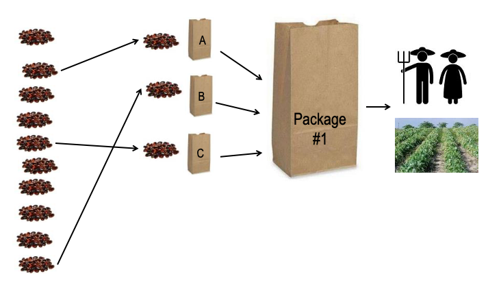
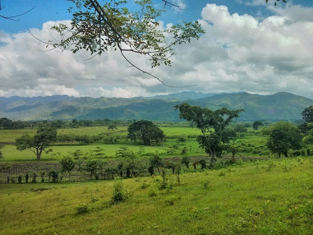
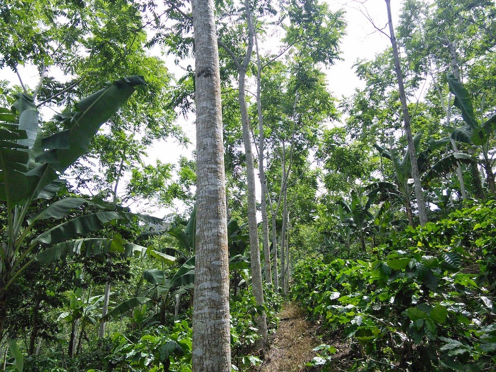
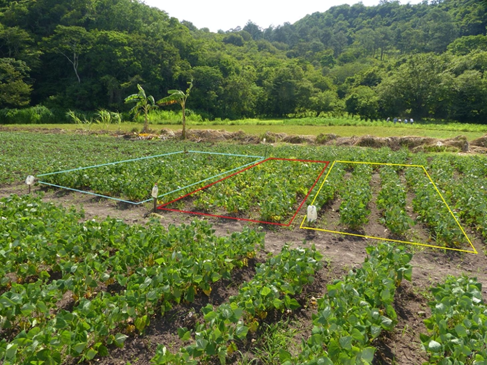

```{r setup, include=FALSE}
library("knitr")
library("kableExtra")
library("tidyverse")
```

# Abstract


Agriculture is a dynamic activity that constantly evolve since its origin. It sustains food and other goods that the global population depends on. Aiming to ensure global food security, the sector has evolved dramatically, especially over the last century with the introduction of high-yielding crops, improved technology, and pathogen resistant and nutrition enriched varieties, to name a few. Still, according to the FAO, the food security issue is constantly present. In 2018, around 26% of the world population experienced either a moderate or severe level of food insecurity. Climate change makes the challenge of food security even more accurate. To cope with climate change and global food insecurity, the whole food system needs to be transformed, including at farm level but also on how food is distributed and what we eat. It is argued that increased agrobiodiversity through farm diversification and varietal selection can help farmers to cope up with the negative effects of climate change while ensuring food security. However, such approaches have been difficult to scale up. One could argue that we often lack information to understand the contexts that drives farmers’ adaptation decisions. In this thesis we developed methods and tools to support farmers and stakeholders in adapting to a changing climate. We compiled evidence and insights from three continents to improve the understanding of the food systems at the farm level, and specifically for smallholders.

\pagebreak

# Sammendrag

Landbruk er en dynamisk aktivitet som stadig utvikler seg siden opphavet. Den opprettholder mat og andre varer som verdens befolkning er avhengig av. Sektoren har som mål å sikre global matsikkerhet utviklet seg dramatisk, spesielt i løpet av det siste århundret med introduksjon av høye avlinger, forbedret teknologi og patogene resistente og ernæringsanrikede varianter, for å nevne noen. Fortsatt, ifølge FAO, er matsikkerhetsspørsmålet stadig til stede. I 2018 opplevde rundt 26% av verdensbefolkningen enten et moderat eller alvorlig nivå av matusikkerhet. Klimaendringer gjør utfordringen med matsikkerhet enda mer nøyaktig. For å takle klimaendringer og global matusikkerhet, må hele matsystemet transformeres, inkludert på gårdsnivå, men også på hvordan mat blir distribuert og hva vi spiser. Det argumenteres for at økt agrobiodiversitet gjennom diversifisering av gårdsbruk og sortering av sorter kan hjelpe bønder til å takle de negative effektene av klimaendringer og samtidig sikre matsikkerhet. Slike tilnærminger har imidlertid vært vanskelig å skalere opp. Man kan hevde at vi ofte mangler informasjon for å forstå sammenhenger som driver bøndenes tilpasningsvedtak. I denne oppgaven utviklet vi metoder og verktøy for å støtte bønder og interessenter i å tilpasse seg et klima i endring. Vi samlet bevis og innsikt fra tre kontinenter for å bedre forståelsen av matsystemene på gårdsnivå, og spesielt for småbrukere.

\pagebreak
\tableofcontents
\pagebreak
\listoffigures
\pagebreak
\listoftables

\pagebreak

# Abbreviations

AIC - Akaike information criterion

CATIE - Tropical Agricultural Research and Higher Education Center

CGIAR - Consultative Group on International Agricultural Research

CHIRPS - Climate Hazards Group InfraRed Precipitation with Station

ICRAF - World Agroforestry

MAP - Mesoamerican Agroenvironmental Program

RCP - Representative Concentration Pathways

SDM - Species Distribution Model 

TRICOT - Triadic Comparison of Technologies

\pagebreak

# List of papers

**Paper I**

**K de Sousa**, F Casanoves, J Sellare, A Ospina, JG Suchini, A Aguilar, L Mercado, L. (2018). “How climate awareness influences farmers’ adaptation decisions in Central America?” *Journal of Rural Studies*, 64, 11–19. https://doi.org/10.1016/j.jrurstud.2018.09.018

**Paper II**

**K de Sousa**, M van Zonneveld, M Holmgren, R Kindt, JC Ordoñez (2019). “The future of coffee and cocoa agroforestry in a warmer Mesoamerica”. *Scientific Reports*, 9(1), 8828. https://doi.org/10.1038/s41598-019-45491-7

**Paper III**

J van Etten, **K de Sousa**, A Aguilar, M Barrios, A Coto, M Dell’Acqua, C Fadda, Y Gebrehawaryat, J van de Gevel, A Gupta, AY Kiros, B Madriz, P Mathur, DK Mengistu, L Mercado, J Nurhisen Mohammed, A Paliwal, ME Pè, CF Quirós, JC Rosas, N Sharma, SS Singh, IS Solanki, J Steinke (2019). “Crop variety management for climate adaptation supported by citizen science”. *Proceedings of the National Academy of Sciences*, 116(10), 4194–4199. https://doi.org/10.1073/pnas.1813720116

**Paper IV**

**K de Sousa**, J van Etten, J Poland, C Fadda, JL Jannink, YG Kidane, BF Lakew, DF Mengistu, ME Pè, SØ Solberg, M Dell’Acqua. (2020) “Data-driven decentralised breeding increases genetic gain in a challenging crop production environment”. Manuscript submitted to Nature Communications.

**Paper V**

**K de Sousa**, J van Etten, SØ Solberg (2020). “Climate variability indices for ecological and crop models in R: the `climatrends` package”. 


\pagebreak

# Introduction

# Objectives

In this project I focussed in provide insights and develop methods to support farmers and stakeholders in adapting agricultural systems to a changing climate, specifically for smallholders, by answering the following questions:

**How does climate awareness influences farmers’ adaptation decisions? (Paper I)**

Climate change increases the risks and uncertainties associated with agriculture, particularly for smallholders [@Altieri2017; @Campbell2016]. The evidence has shown that the adoption of agricultural innovations and climate-adapted practices can help vulnerable farmers to cope with the effects of climate variability and change [@Lipper2014; @Vermeulen2013; @Vermeulen2012]. These practices include farm sustainable intensification, diversification of production, agroforestry, crop variety management and plant breeding. Farmers' awareness and perceptions of climate change are correlated with the adoption of such innovations [@Elum2017; @Niles2016; @Schattman2016; @Singh2017], but no evidence is provided for smallholders in Central America. Paper I [@deSousa2018] targets this knowledge gap. 

**What is the future of current agroforestry combinations in coffee and cocoa production systems? (Paper II)**

Agroforestry, the deliberate and simultaneous management of trees within crop or livestock systems, is considered an important climate-adapted innovation to increase the resilience of agricultural systems [@Nair1993; @Spurgeon1979]. Trees can ameliorate the micro-climate and facilitate the performance of understory crops [@Holmgren2010]. Most perennial crop systems in Central America are managed following agroforestry practices [@Beer1998; @Somarriba2013], and have been increasingly encouraged as climate change is projected to affect future crop production [@OvalleRivera2015]. Nevertheless, climate change can also affect the future ecological niches of several tree species [@Holmgren2013; @Lyra2017] and may restrain the prospects of agroforestry as a viable approach for climate adaptation. Paper II [@deSousa2019] assesses the future of the 100 most common tree species found in coffee (*Coffea arabica* L.) and cocoa (*Theobroma cacao* L.) production systems in Central America.

**Can cocoa become a suitable alternative in vulnerable coffee production areas? (Paper III)**

As climate change projections points to a decline in coffee production due to the increasingly climate variability [@OvalleRivera2015; @Bunn2015; @Laderach2017], farmers has developed a taste for cocoa. The drivers of this shift are trends in recent years of increasing coffee production costs and large loses due to pests and diseases (e.g. leaf rust crisis) [@Avelino2015]. Replacing coffee by cocoa has become one of the main strategies for climate change adaptation for producers in low elevation areas [@Laderach2017]. Nevertheless, there is no quantitative assessment of the feasibility of such strategy, starting from considering that cocoa is vulnerable to climate change itself [@Schroth2016]. Paper II [@deSousa2019] also explore this strategy assessing the potential areas where cocoa is a suitable alternative to coffee.


**Can on-farm participatory crop trials generate insights into variety management for climate adaptation? (Paper III)**

Crop improvement increases production and contribute the food and nutrition security [@Hickey2019; @Godfray2010]. Previous studies has shown that is critical that farmers keep a continuous turnover of improved and local-adapted varieties for climate adaptation [@Challinor2016; @Atlin2017]. One constrain, however, in adopting this practice is the cost in investing in seasonal management. Farmers often rely on their local varieties and changing to new ones can increase the risks when the performance of these varieties under local conditions is unknown [@Dawson2008]. Existing approaches to generate these recommendations lack the ability to provide such recommendations in marginal production environments across space and time. Paper III [@vanEtten2019] address this issue by exploring a participatory approach to characterise varietal climatic responses allowing for seasonal and geographical extrapolation. 

**Can a data-driven decentralised approach improve the selection of genotypes in challenging crop production environments? (Paper IV)**

To adapt to climate change farmers require accelerated selection of genotypes and production of local-adapted varieties [@Godfray2010; @Eshed2019]. Conventional breeding programs have proven high success in maximizing genetic diversity in the early stages of selection and then identifying superior germplasm [@Hickey2019]. At present, plant breeders use genomic selection to increase selection intensity while reducing the time of the breeding cycle and deriving greater genetic gain. However, the same approach does not translate well in marginal environments characterised by a diversity of environments and management practices [@Annicchiarico2019]. Decentralised participatory approaches could help breeders in accelerate the selection of genotypes while addressing the $G \times E \times M$ interactions required for challenging crop production environments [@Ceccarelli2019; @vanEeuwijk2001; @Tester2010; @vanEtten2019tricot; @Annicchiarico2019]. Paper IV (de Sousa et al 2020) addresses this issue by proposing a decentralised data-driven approach scaled by citizen science.

# Methods

## Research sites

The studies took place in three different regions, Central America, East Africa and South Asia (Fig. 1). The regions are characterised by its rich plant diversity being *Centre of Origin* and domestication [@Vavilov] of important staples and crops such as common beans (*Phaseolus vulgaris* L.), durum wheat (*Triticum durum* Desf.), maize (*Zea mays* L.), rice (*Oryza sativa* L.), wheat (*Triticum aestivum* L.), coffee and cocoa. Smallholder agriculture and livestock production are the main livelihood for the majority of the population. Poverty and food insecurity levels are still among the higher in the world. According to the 2019's report on the State of Food Security and Nutrition [@SOFI2019], in 2018 Central America, East Africa and South Asia, respectively, had a prevalence of severe or moderate food insecurity for 31.5%, 62.7% and 34.3% of their total population. 

```{r fig1, fig.cap="Research sites. (A) Overview. (B) India. (C) Central America. (D) Ethiopia. Farms included in the trials or interviews are indicated as dots.", echo=FALSE, out.width = '90%', fig.align="center"}
knitr::include_graphics("display-items/Fig1_ResearchSites.png")
```

Field data was collected between 2010 and 2016 as part of several Research for Development programs performed across the regions. In Central America, farmer's surveys were conducted in El Salvador, Guatemala, Honduras and Nicaragua. A subset of participatory crop trials were conducted in Nicaragua. Sampled farmers extended across three ecological regions [@Olson2001], the Central American Atlantic Moist Forests, the Central American Dry Forests and the Central American Pine-Oak Forests. Important crops grown by smallholders in the region are maize, common bean, sorghum (*Sorghum bicolor* (L.) Moench), banana (*Musa* spp.), coffee and cocoa, the last two grown for the international markets, while the others for local markets and household consumption. 

```{r site_chars, echo=FALSE, message=FALSE, results="asis", warning = FALSE}
tb <- as.data.frame(matrix(
  c("Central America", "597 (190–1,900)", "23 (17–29)", "1,717 (905–2,122)", "3",
    "East Africa", "2,598 (1,960-3,200)", "15 (6-25)", "976 (671–1,078)", "1",
    "South Asia", "85 (42-571)", "25 (9-39)", "1,024 (808-1,280)", "3"),
  nrow = 3, ncol = 5, byrow = TRUE
))

names(tb) <- c("Research site", "Elevation (m)", "Temperature (°C)", "Precipitation (mm)", "Ecoregions")

kable(tb, booktabs = TRUE, 
      align = "lcccc",
      caption = "Environmental characteristics of sampled locations across the research sites.") %>% 
  kable_styling(latex_options = "hold_position",
                position = "center",
                font_size = 9) 
```


In East Africa, the research was conducted in the regions of Amhara, Oromia and Tigray in Ethiopia, which encompasses one main ecological region, the Ethiopian Montane Grasslands and Woodlands. The main crop grown by smallholder farmers in this region are durum wheat, teff (*Eragrostis tef* (Zucc.) Trotter), barley (*Hordeum vulgare* L.) and sorghum, mostly for household consumption and local markets. In South Asia, the research was conducted across the States of Bihar, Madhya Pradesh and Uttar Pradesh in India encompassing three ecological regions, the Upper Gangetic Plains Moist Deciduous Forests, the Lower Gangetic Plains Moist Deciduous Forests, and the Narmada Valley Dry Deciduous Forests. The main crop grown by smallholders are rice, wheat, maize, and several pulses and vegetables. Table 1 presents a description on the environmental characteristics of each region extracted from the sampled locations used in this research. 


## Farmers' climate awareness and adaptation strategies

This part of the research was performed exclusively in Central America. In 2014, we performed a survey to 283 households participating in the Mesoamerican Environmental Program (MAP) [@Gutierrez2020]. Farmers were questioned about their perceptions regarding changes in precipitation and temperature over the 10 years before the interviews (2005–2014). Farmers who reported to have felt changes in climatic patterns were asked to list the farm management practices they have adopted in their crop systems to cope with such changes. These practices were ranked by the order they were mentioned. We wanted to answer two main questions, (*i*) how accurate are the farmers' perceptions to climate change with observed time series data?, and (*ii*) how socioeconomic factors influence farmers' adaptation decisions?. 

To address the first question we linked the farmers responses as categorical variables (e.g. more precipitation, less precipitation, uncertain rain season) to a gridded time series precipitation database from the Climate Hazards Group InfraRed Precipitation with Station (CHIRPS) dataset [@Funk2015]. This database incorporates global daily rainfall from 1983 to near-present with a resolution of 2.5 arc-min, which is obtained by weather stations and combined with remote sensing. Changes in precipitation were assessed by calculating three extreme precipitation indices using an earlier version of the R [@RCoreTeam] package `climatrends` [@climatrends]. For this analysis we used the simple daily intensity index (SDII, total precipitation/rainy days), the maximum 5-day precipitation (Rx5day), and the maximum length of consecutive dry days (MLDS). The association of observed changes in precipitation and farmers’ perceptions was assessed using a multiple correspondence analysis using the R package `FactoMineR` [@Le2008].

The second question was answered by linking the farmers prioritised adaptation management strategies with their socioeconomic information. Household socioeconomic data was obtained by the baseline survey performed with all farmers under the Mesoamerican Environmental Program. From the adaptation strategies derived from all responses, we compiled a list of 10 options: (*i*) Change in Agricultural Calendar, (*ii*) Change in Varieties, (*iii*) Production Diversification, (*iv*) Introduction of New Crops, (*v*) Less Fertilizers and Pesticides, (*vi*) Reforestation and Restoration, (*vii*) Sustainable Soil Management, (*viii*) Sustainable Water Management, (*ix*) Leave Farming System, and (*x*) More Fertilizers and Pesticides. 

The relative importance of the different strategies was measured using the Bradley-Terry model [@Bradley1952], which estimates the *worth parameter* (relative importance) in pairwise comparisons and can be described using the following equation. 

Equation [1]

$$P (i \succ j) = \frac{p_i}{p_i + p_j}$$

where $p_i$ is a positive real-valued score assigned to individual $i$. The comparison $i \succ j$ can be read as "$i$ is preferred over $j$"

We used the top 5 strategies mentioned by each interviewed farmer and converted it into pairwise comparisons using an earlier version of the R package `gosset` [@gosset]. Socioeconomic variables were linked to the pairwise rankings using the Model-Based Recursive Partitioning approach [@Zeileis2008] implemented in R by the package `psychotree` [@Strobl2011]. The algorithm starts by fitting a Bradley-Terry model to the full data, then it assesses the stability of the worth parameters, if there is a significant instability, the full data is split by the covariate with strong instability. The process is repeated until there is no more significant instability [@Zeileis2008]. We linked six covariates: (*i*) the ecoregion (Dry or Rainforest), (*ii*) the Progress Out of Poverty Index (PPI), (*iii*) the literacy level of the head of household, (*iv*) the area of the main crop system (ha), (*v*) the age of the head of household, and (*vi*) the number of practices adopted by the farmers after participating in the Farmers Field Schools led by MAP.


## Mapping future suitability of coffee and cocoa agroforestry

This assessment focussed on Central America within the coordinates 101-77 E and 7-22 N. We wanted to answer two main questions, (*i*) how ecologically resilient are the trees commonly used by farmers in coffee and cocoa agroforestry systems?, (*ii*) can cocoa become a potential suitable alternative for coffee growers?. These questions came out as a result from the assessment on farmers' adaptation decisions described in the earlier section. Among the 10 adaptation decisions mentioned by the interviewed farmers, restoration and reforestation (using agroforestry) were the most preferred [@deSousa2018]. 

To answer the first question we assessed the current and future potential distribution of the top-100 commonly used tree species in cocoa and coffee plantations across Central America. The selection of the 100 species was based on three criteria. The first was the abundance reported in relevant datasets of agroforestry inventories conducted in smallholder farms across the region [@Bonilla2014; @Orozco2014; @Sepulveda2016], selecting from the most abundant to the least. We then filtered the list of species based on ecological and economic services identified by farmers and reported in the literature [@CATIE2003], taxa were classified by their main use, N-fixing, timber or fruit. The last criterion was the availability of at least 60 geographical records to ensure accurate modelling results. To answer the second question we compared the current potential areas for coffee and cocoa production with their projected distribution under climate change scenarios. 

Bioclimatic predictors from WorldClim v1.4 [@Hijmans2005] were used to model the current distribution of the 100 species, coffee and cocoa. These bioclimatic variables are widely used in ecology to model the distribution of species based on their interaction with the variation in precipitation and temperature [@Booth2018]. To avoid model overfitting we selected the least correlated variables based the variance inflation factors, retaining those with VIF < 10 [@Ranjitkar2014]. This resulted in nine bioclimatic variables. Future projections were based on two Representative Concentration Pathways (RCP) scenarios of climate change [@vanVuuren2011], RCP4.5 as an intermediate scenario and RCP8.6 as a high emissions scenario. We used future bioclimatic variables downscaled from 17 General Circulation Models that were available for both RCP scenarios. 

The distribution of the 100 species and coffee and cocoa was modelled using an ensemble suitability method implemented by the R package `BiodiversityR` [@Kindt2018]. The procedure consists of four steps that, first, calibrate the model by assessing the performance of 18 algorithms of species distribution models (SDM) measured with the area under the curve (AUC). In this step, the AUC values obtained by each algorithm are weighed using the following equation: 

Equation [2]

$$S_e = \frac{\sum_i w_i S_i}{\sum_i w_i}$$

where the ensemble suitability ($S_e$) is obtained as a weighted ($w$) average of suitabilities predicted by the contributing algorithm ($S_i$).

The second step, consists in retaining only the algorithms that contributed at least in 5$\%$ to the ensemble suitability ($S_e$). The third step generates the suitability maps using the predictions from the algorithms that were selected in the second step. Finally, to generate the presence–absence layers, we convert the consensus suitability from the third step using the threshold of maximum specificity $+$ maximum sensitivity [@Liu2013]. Replication data and code used in this analysis are available through Dataverse [@deSousa2018data].

## Evaluation of crop varieties

This part of the research was performed between 2012 and 2016 during three cropping seasons in Ethiopia, five cropping seasons in Nicaragua, and four cropping seasons in India (Table 2). Three crops were evaluated, common beans in Nicaragua, durum wheat in Ethiopia and wheat in India. The question that we addressed was whether on-farm participatory crop trials, scaled through a farmer citizen science approach, can provide robust, actionable information on varietal climate adaptation. This question aimed to respond to one open question in the assessment of farmers' adaptation decisions where change in crop varieties (or crop variety management) showed to be one of the least choices in adaptation decisions among the farmers.

```{r nplots, echo=FALSE, message=FALSE, results="asis", warning = FALSE}
tb <- as.data.frame(matrix(
  c("2012","-","562","-","-","-",
    "2013","176","4,134","-","-","-",
    "2014","578","4,947","-","-","-",
    "2015","336","834","-","481","177",
    "2016","-","-","64","87","33"),
  nrow = 5, ncol = 6, byrow = TRUE
))

names(tb) <- c("Research Site", "Ethiopia", "India", "Primera", "Apante", "Postrera")

kable(tb, 
      booktabs = TRUE,
      align = "lccccc",
      caption = "Number of tricot trials per cropping season of durum wheat (Ethiopia, Meher season), bread wheat (India, Rabi season), and common beans (Nicaragua, Primera, Apante and Postrera seasons).") %>% 
  add_header_above(c(" " = 3, "Nicaragua" = 3)) %>% 
  kable_styling(latex_options = "hold_position",
                position = "center",
                font_size = 9)
```


We compiled data from 12,409 farmer-managed plots across the research sites. Trial design followed the triadic comparison of technologies (tricot) approach [@vanEtten2019tricot]. The approach follows five principles:  (*i*) anonymous subsets of three varieties (out of a larger set) are allocated randomly as incomplete blocks [@Atlin2001]; (*ii*) participants receive one subset to grow in their farms under their own management practices (Figure 2); (*iii*) plots are set up within the crop system, plots are small to facilitate participation but large enough to avoid strong edge effects; (*iv*) participants indicate the relative performance of varieties through ranking answering to two short statements for each targeted characteristic (e.g. which variety had the best leaf development? which variety had worst leaf development?); (*v*) data from each farmer-managed plot is collated into a single dataset.

For the analysis of the ranking data generated by farmers, we used the Plackett–Luce model [@Luce1959; @Plackett1975], implemented in R with the package `PlackettLuce` [@Turner2020]. Alike the Bradley-Terry model explained in the previous section, the Plackett-Luce model estimates the worth parameter, but in that case it is estimated as the probability that one item (a variety) wins against all the others in the permutation (Bradley-Terry measures as pairwise comparison). The model determines the values of positive-valued parameters $\alpha_i$ (worth) associated with each variety $i$. These parameters $\alpha$ are related to the probability that variety $i$ wins against all other n varieties in the following way:

Equation [3]

$$P(i \succ \{j, ..., n\}) = \frac{a_i}{a_1 + ... + a_n}$$
\
Climatic variables were linked to the rankings using the Model-Based Recursive Partitioning approach [@Zeileis2008] implemented in R by the package `psychotree` [@Strobl2011] which builds the Plackett-Luce trees. This process is explained in the previous section on farmers' adaptation decisions. For the climatic variables, we used free publicly available datasets with coverage across all the research sites to make comparable studies. We derived rainfall and temperature indices using an earlier version of the R package `climatrends` [@climatrends]. Rainfall was obtained using the CHIRPS dataset [@Funk2015], while temperature was obtained from MODIS MYD11A2 [@Wan2015]. The MODIS data was provided in its raw format, to reduce noise and fill gaps, we used the adaptive Savitzky-Golay filter with a window size of 12 for the polynomial smoothing [@Chen2004].

Fourteen climatic variables were extracted for the vegetative, reproductive and grain filling period and the whole growth period (from planting date to harvesting) in each observation point. This resulted in 100 variables. To create models that provide generalizable predictions across seasons, we used blocked cross-validation (with seasons as blocks) combined with a forward variable selection procedure [@Meyer2018]. We used the deviance values of each validation season to calculate an Akaike weight, which is the probability that a given variable combination represents the best model [@Wagenmakers2004]. We performed forward variable selection, using this combined Akaike weight as our selection criterion. From each study case (country) this procedure retained one variable, which were the maximum night temperature ($^\circ$C) during the vegetative and reproductive periods for common beans in Nicaragua, the minimum night temperature ($^\circ$C) during the vegetative period for durum wheat in Ethiopia, and the diurnal temperature range ($^\circ$C) during the vegetative period for wheat in India. 

```{r tricotdesign, fig.cap="Randomization and subset allocation in the tricot approach. Three varieties are randomly selected from a larger group and anonymised with the labels A, B, C, participants receive the anonymous subset to evaluated in their farms under their own management practices.", echo=FALSE, out.width = '90%', fig.align="center"}

```


We compared the goodness-of-fit of the model with climatic variables (climate model) against three other models. The first with no covariates (intercept only model), the second with geolocation, season, planting dates, and soil categories, which represented the experimental design (design model). And the third model with a combination of climatic variables plus geolocation (climate + geolocation model). To compare the models, we calculated a weighted average of pseudo-$R^2$ (deviance reduction) values across testing seasons [@Agresti2002], using the square root of the sample size as weights [@Whitlock2005]. All this process was done using an earlier version of the R package `gosset` [@gosset]. Replication data and code used in this analysis are available through Dataverse [@vanettenreplic]

## Genotype selection


# Results and discussion

## Farmers' adaptation decisions

## Diversifying with trees 

## Changing crop varieties

```{r 3dbreeding, echo=FALSE, message=FALSE, results="asis", warning = FALSE}
tb <- as.data.frame(matrix(
  c("Centralised GS","","",
    "Season 1 (n=179)","0.134","-0.012",
    "Season 2 (n=651)","0.105","0.076",
    "Season 3 (n=335)","0.183","0.073",
    "", "0.141 (± 0.039)","0.046 (± 0.049)",
    "3D-breeding","","",
    "Season 1 (n=179)","0.270","0.160",
    "Season 2 (n=651)","0.276", "0.078",
    "Season 3 (n=335)", "0.203", "0.119",
    "", "0.251 (± 0.040)", "0.109 (± 0.041)"),
  nrow = 10, ncol = 3, byrow = TRUE
))

names(tb) <- c("Approach", "OA", "GY")

kable(tb, 
      booktabs = TRUE,
      align = "lcc",
      caption = "Performance of the 3D-breeding compared with the benchmark of a centralised genomic selection. 3D-breeding provides higher across-season goodness-of-fit (Kendall $\\tau$) than centralised genomic selection on farmers’ overall appreciation (OA) and grain yield (GY)") %>% 
  kable_styling(latex_options = "hold_position",
                position = "center",
                font_size = 9) 
```

# Conclusions

# Future research and perspective
  
\pagebreak

# Funding statement

The research in the papers published alongside this work has been possible thanks to the financial support of multiple funding agencies. We thank the Royal Embassy of Norway (contract no. CAM-2647-12/0004, MAP Norway Second Phase). The US Agency for International Development, which supported this research via the Cooperative Agreement AID-OAA-F-14-00035, made possible by the generous support of the American people. The McKnight Foundation (grant num. CCRP 16–098). The German Federal Ministry for Economic Cooperation and Development (grant num. 81194988). The Nordic Joint Committee for Agricultural and Food Research (grant num. 202100-2817). Hivos International (grant num. HI-A70D41/A1092). This work was implemented as part of the CGIAR Research Program on Forests, Trees and Agroforestry (FTA) and the CGIAR Research Program on Climate Change, Agriculture and Food Security (CCAFS), which are carried out with support from the CGIAR Trust Fund and through bilateral funding agreements. For details, please visit https://www.cgiar.org/funders. 

\pagebreak

# Acknowledgements

\pagebreak

# References

<div id="refs"></div>
  
\pagebreak

# Appendices

\pagebreak


\Huge \textbf{Paper I}
\
```{r paper1, echo=FALSE, out.width = '100%', fig.align="center"}

```

\normalsize Overview of the agricultural landscape in Copán, Honduras

\includepdf[pages={-}]{article-1/deSousa_etal_2018_rural_studies.pdf}

\Huge \textbf{Paper II}
\
```{r paper2, echo=FALSE, out.width = '100%', fig.align="center"}

```
\normalsize Coffee agroforestry system in El Cuá, Nicaragua

\includepdf[pages={-}]{article-2/deSousa_etal_2019_scientific_reports.pdf}

\Huge \textbf{Paper III}
\
```{r paper3, echo=FALSE, out.width = '100%', fig.align="center"}

```

\normalsize Farmer evaluating a common beans plot under the *tricot* approach, Honduras

\includepdf[pages={-}]{article-3/vanEtten_deSousa_etal_2019_pnas.pdf}

\Huge \textbf{Paper IV}

