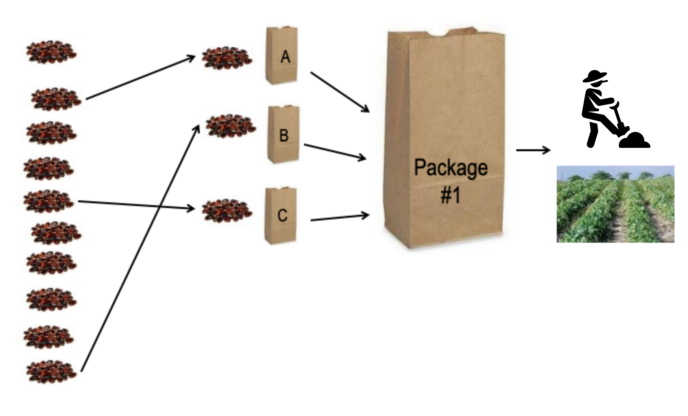

```{r setup, include=FALSE}
library("knitr")
library("kableExtra")
library("tidyverse")
```

# Abstract


Agriculture is a dynamic activity that constantly evolve since its origin. It sustains food and other goods that the global population depends on. Aiming to ensure global food security, the sector has evolved dramatically, especially over the last century with the introduction of high-yielding crops, improved technology, and pathogen resistant and nutrition enriched varieties, to name a few. Still, according to the FAO, the food security issue is constantly present. In 2018, around 26% of the world population experienced either a moderate or severe level of food insecurity. Climate change makes the challenge of food security even more accurate. To cope with climate change and global food insecurity, the whole food system needs to be transformed, including at farm level but also on how food is distributed and what we eat. It is argued that increased agrobiodiversity through farm diversification and varietal selection can help farmers to cope up with the negative effects of climate change while ensuring food security. However, such approaches have been difficult to scale up. One could argue that we often lack information to understand the contexts that drives farmers’ adaptation decisions. In this thesis we developed methods and tools to support farmers and stakeholders in adapting to a changing climate. We compiled evidence and insights from three continents to improve the understanding of the food systems at the farm level, and specifically for smallholders.

\pagebreak

# Sammendrag

Landbruk er en dynamisk aktivitet som stadig utvikler seg siden opphavet. Den opprettholder mat og andre varer som verdens befolkning er avhengig av. Sektoren har som mål å sikre global matsikkerhet utviklet seg dramatisk, spesielt i løpet av det siste århundret med introduksjon av høye avlinger, forbedret teknologi og patogene resistente og ernæringsanrikede varianter, for å nevne noen. Fortsatt, ifølge FAO, er matsikkerhetsspørsmålet stadig til stede. I 2018 opplevde rundt 26% av verdensbefolkningen enten et moderat eller alvorlig nivå av matusikkerhet. Klimaendringer gjør utfordringen med matsikkerhet enda mer nøyaktig. For å takle klimaendringer og global matusikkerhet, må hele matsystemet transformeres, inkludert på gårdsnivå, men også på hvordan mat blir distribuert og hva vi spiser. Det argumenteres for at økt agrobiodiversitet gjennom diversifisering av gårdsbruk og sortering av sorter kan hjelpe bønder til å takle de negative effektene av klimaendringer og samtidig sikre matsikkerhet. Slike tilnærminger har imidlertid vært vanskelig å skalere opp. Man kan hevde at vi ofte mangler informasjon for å forstå sammenhenger som driver bøndenes tilpasningsvedtak. I denne oppgaven utviklet vi metoder og verktøy for å støtte bønder og interessenter i å tilpasse seg et klima i endring. Vi samlet bevis og innsikt fra tre kontinenter for å bedre forståelsen av matsystemene på gårdsnivå, og spesielt for småbrukere.

\pagebreak
\tableofcontents
\pagebreak
\listoffigures
\pagebreak
\listoftables

\pagebreak

# Abbreviations

CHIRPS - Climate Hazards Group InfraRed Precipitation with Station

MAP - Mesoamerican Agroenvironmental Program

RCP - Representative Concentration Pathways

SDM - Species Distribution Model 

TRICOT - Triadic Comparison of Technologies

\pagebreak

# List of papers

**Paper I**

**K de Sousa**, F Casanoves, J Sellare, A Ospina, JG Suchini, A Aguilar, L Mercado, L. (2018). “How climate awareness influences farmers’ adaptation decisions in Central America?” *Journal of Rural Studies*, 64, 11–19. https://doi.org/10.1016/j.jrurstud.2018.09.018

**Paper II**

**K de Sousa**, M van Zonneveld, M Holmgren, R Kindt, JC Ordoñez (2019). “The future of coffee and cocoa agroforestry in a warmer Mesoamerica”. *Scientific Reports*, 9(1), 8828. https://doi.org/10.1038/s41598-019-45491-7

**Paper III**

J van Etten, **K de Sousa**, A Aguilar, M Barrios, A Coto, M Dell’Acqua, C Fadda, Y Gebrehawaryat, J van de Gevel, A Gupta, AY Kiros, B Madriz, P Mathur, DK Mengistu, L Mercado, J Nurhisen Mohammed, A Paliwal, ME Pè, CF Quirós, JC Rosas, N Sharma, SS Singh, IS Solanki, J Steinke (2019). “Crop variety management for climate adaptation supported by citizen science”. *Proceedings of the National Academy of Sciences*, 116(10), 4194–4199. https://doi.org/10.1073/pnas.1813720116

**Paper IV**

**K de Sousa**, J van Etten, J Poland, C Fadda, JL Jannink, YG Kidane, BF Lakew, DF Mengistu, ME Pè, SØ Solberg, M Dell’Acqua. (2020) “Data-driven decentralised breeding increases genetic gain in a challenging crop production environment”. Manuscript submitted to Nature Communications.

**Paper V**

**K de Sousa**, J van Etten, SØ Solberg (2020). “Climate variability indices for ecological and crop models in R: the `climatrends` package”. 


\pagebreak

# Introduction

# Objectives

In this project I focussed in provide insights and develop methods to support farmers and stakeholders in adapting agricultural systems to a changing climate, specifically for smallholders, by answering the following questions:

**How does climate awareness influences farmers’ adaptation decisions? (Paper I)**

Climate change increases the risks and uncertainties associated with agriculture, particularly for smallholders [@Altieri2017; @Campbell2016]. The evidence has shown that the adoption of agricultural innovations and climate-adapted practices can help vulnerable farmers to cope with the effects of climate variability and change [@Lipper2014; @Vermeulen2013; @Vermeulen2012]. These practices include farm sustainable intensification, diversification of production, agroforestry, crop variety management and plant breeding. Farmers' awareness and perceptions of climate change are correlated with the adoption of such innovations [@Elum2017; @Niles2016; @Schattman2016; @Singh2017], but no evidence is provided for smallholders in Central America. Paper I [@deSousa2018] targets this knowledge gap. 

**What is the future of current agroforestry combinations in coffee and cocoa production systems? (Paper II)**

Agroforestry, the deliberate and simultaneous management of trees within crop or livestock systems, is considered an important climate-adapted innovation to increase the resilience of agricultural systems [@Nair1993; @Spurgeon1979]. Trees can ameliorate the micro-climate and facilitate the performance of understory crops [@Holmgren2010]. Most perennial crop systems in Central America are managed following agroforestry practices [@Beer1998; @Somarriba2013], and have been increasingly encouraged as climate change is projected to affect future crop production [@OvalleRivera2015]. Nevertheless, climate change can also affect the future ecological niches of several tree species [@Holmgren2013; @Lyra2017] and may hamper the prospects of agroforestry as a viable approach for climate adaptation. Paper II [@deSousa2019] assesses the future of the 100 most common tree species found in Arabica coffee (*Coffea arabica* L.) and cocoa (*Theobroma cacao* L.) production systems in Central America.

**Can cocoa become a suitable alternative in vulnerable coffee production areas? (Paper III)**

As climate change projections points to a decline in coffee production due to the increasingly climate variability [@OvalleRivera2015; @Bunn2015; @Laderach2017], farmers has developed a taste for cocoa. The drivers of this shift are trends in recent years of increasing coffee production costs and large loses due to pests and diseases (e.g. leaf rust crisis) [@Avelino2015]. Replacing coffee by cocoa has become one of the main strategies for climate change adaptation for producers in low elevation areas [@Laderach2017]. Nevertheless, there is no quantitative assessment of the feasibility of such strategy, starting from considering that cocoa is vulnerable to climate change itself [@Schroth2016]. Paper II [@deSousa2019] also explore this strategy assessing the potential areas where cocoa is a suitable alternative to coffee.


**Can on-farm participatory crop trials generate insights into variety management for climate adaptation? (Paper III)**

Crop improvement increases production and contribute the food and nutrition security [@Hickey2019; @Godfray2010]. Previous studies has shown that is critical that farmers keep a continuous turnover of improved and local-adapted varieties for climate adaptation [@Challinor2016; @Atlin2017]. One constrain, however, in adopting this practice is the cost in investing in seasonal management. Farmers often rely on their local varieties and changing to new ones can increase the risks when the performance of these varieties under local conditions is unknown [@Dawson2008]. Existing approaches to generate these recommendations lack the ability to provide such recommendations in marginal production environments across space and time. Paper III [@vanEtten2019] address this issue by exploring a participatory approach to characterise varietal climatic responses allowing for seasonal and geographical extrapolation. 

**Can a data-driven decentralised approach improve the selection of genotypes in challenging crop production environments? (Paper IV)**

To adapt to climate change farmers require accelerated selection of genotypes and production of local-adapted varieties [@Godfray2010; @Eshed2019]. Conventional breeding programs have proven high success in maximizing genetic diversity in the early stages of selection and then identifying superior germplasm [@Hickey2019]. At present, plant breeders use genomic-driven approaches to increase selection intensity while reducing the time of the breeding cycle and deriving greater genetic gain. However, the same approach does not translate well in marginal environments characterised by a diversity of environments and management practices [@Annicchiarico2019]. Decentralised participatory approaches could help breeders in accelerate the selection of genotypes while addressing the $G \times E \times M$ interactions required for challenging crop production environments [@Ceccarelli2019; @vanEeuwijk2001; @Tester2010; @vanEtten2019tricot; @Annicchiarico2019]. Paper IV [@deSousa2020] addresses this issue by proposing a decentralised data-driven approach scaled by citizen science.

# Methods

## Research sites

The studies took place in three different regions, Central America, East Africa and South Asia (Fig. 1). The regions are characterised by its rich plant diversity being *Centre of Origin* and domestication [@Vavilov] of important staples and crops such as common beans (*Phaseolus vulgaris* L.), durum wheat (*Triticum durum* Desf.), maize (*Zea mays* L.), rice (*Oryza sativa* L.), wheat (*Triticum aestivum* L.), coffee and cocoa. Smallholder agriculture and livestock production are the main livelihood for the majority of the population. Poverty and food insecurity levels are still among the higher in the world. According to the 2019's report on the State of Food Security and Nutrition [@SOFI2019], in 2018 Central America, East Africa and South Asia, respectively, had a prevalence of severe or moderate food insecurity for 31.5%, 62.7% and 34.3% of their total population. 

```{r fig1, fig.cap="Research sites. (A) Overview. (B) India. (C) Central America. (D) Ethiopia. Farms included in the trials or interviews are indicated as dots.", echo=FALSE, out.width = '90%', fig.align="center"}
knitr::include_graphics("display-items/research_sites.png")
```

Field data was collected between 2010 and 2016 as part of several Research for Development programs performed across the regions. In Central America, farmer's surveys were conducted in El Salvador, Guatemala, Honduras and Nicaragua. A subset of participatory crop trials were conducted in Nicaragua. Sampled farmers extended across three ecological regions [@Olson2001], the Central American Atlantic Moist Forests, the Central American Dry Forests and the Central American Pine-Oak Forests. Important crops grown by smallholders in the region are maize, common bean, sorghum (*Sorghum bicolor* (L.) Moench), banana (*Musa* spp.), coffee and cocoa, the last two grown for the international markets, while the others for local markets and household consumption. 

```{r site_chars, echo=FALSE, message=FALSE, results="asis", warning = FALSE}
tb <- as.data.frame(matrix(
  c("Central America", "597 (190–1,900)", "23 (17–29)", "1,717 (905–2,122)", "3",
    "East Africa", "2,598 (1,960-3,200)", "15 (6-25)", "976 (671–1,078)", "1",
    "South Asia", "85 (42-571)", "25 (9-39)", "1,024 (808-1,280)", "3"),
  nrow = 3, ncol = 5, byrow = TRUE
))

names(tb) <- c("Research site", "Elevation (m)", "Temperature (°C)", "Precipitation (mm)", "Ecoregions")

kable(tb, booktabs = TRUE, 
      align = "lcccc",
      caption = "Environmental characteristics of sampled locations across the research sites.") %>% 
  kable_styling(latex_options = "hold_position",
                position = "center",
                font_size = 9) 
```


In East Africa, the research was conducted in the regions of Amhara, Oromia and Tigray in Ethiopia, which encompasses one main ecological region, the Ethiopian Montane Grasslands and Woodlands. The main crop grown by smallholder farmers in this region are durum wheat, teff (*Eragrostis tef* (Zucc.) Trotter), barley (*Hordeum vulgare* L.) and sorghum, mostly for household consumption and local markets. In South Asia, the research was conducted across the States of Bihar, Madhya Pradesh and Uttar Pradesh in India encompassing three ecological regions, the Upper Gangetic Plains Moist Deciduous Forests, the Lower Gangetic Plains Moist Deciduous Forests, and the Narmada Valley Dry Deciduous Forests. The main crop grown by smallholders are rice, wheat, maize, and several pulses and vegetables. Table 1 presents a description on the environmental characteristics of each region extracted from the sampled locations used in this research. 


## Farmers' climate awareness and adaptation strategies

This part of the research was performed only in Central America. In 2014, we performed a survey to 283 households participating in the Mesoamerican Environmental Program (MAP) [@Gutierrez2020]. Farmers were questioned about their perceptions regarding changes in precipitation and temperature over the 10 years before the interviews (2005–2014). Farmers who reported to have felt changes in climatic patterns were asked to list the farm management practices they have adopted in their crop systems to cope with such changes. These practices were ranked by the order they were mentioned. We wanted to answer two main questions, how accurate are the farmers' perceptions to climate change with observed time series data, and whether socioeconomic factors can influence farmers' adaptation decisions. 

To address the first question we linked the farmers responses as categorical variables (e.g. more precipitation, less precipitation, uncertain rain season) to a gridded time series precipitation database from the Climate Hazards Group InfraRed Precipitation with Station (CHIRPS) dataset [@Funk2015]. This database incorporates global daily rainfall from 1983 to near-present with a resolution of 2.5 arc-min, which is obtained by weather stations and combined with remote sensing. Changes in precipitation were assessed by calculating three extreme precipitation indices using an alpha version of the R [@RCoreTeam] package `climatrends` [@climatrends]. For this analysis we used the simple daily intensity index (SDII, total precipitation/rainy days), the maximum 5-day precipitation (Rx5day), and the maximum length of consecutive dry days (MLDS). The association of observed changes in precipitation and farmers’ perceptions was assessed using a multiple correspondence analysis using the R package `FactoMineR` [@Le2008].

The second question was answered by linking the farmers prioritised adaptation management strategies with their socioeconomic information. Household socioeconomic data was obtained by the baseline survey performed with all farmers for the Mesoamerican Environmental Program. From the adaptation strategies derived from all responses, we compiled a list of 10 options: (*i*) Change in Agricultural Calendar, (*ii*) Change in Varieties, (*iii*) Production Diversification, (*iv*) Introduction of New Crops, (*v*) Less Fertilizers and Pesticides, (*vi*) Reforestation and Restoration, (*vii*) Sustainable Soil Management, (*viii*) Sustainable Water Management, (*ix*) Leave Farming System, and (*x*) More Fertilizers and Pesticides. 

The relative importance of the different strategies was measured using the Bradley-Terry model [@Bradley1952], which estimates the *worth* parameter (relative importance) in pairwise comparisons which can be described using the following equation. 

Equation [1]

$$P (i \succ j) = \frac{p_i}{p_i + p_j}$$

where $p_i$ is a positive real-valued score assigned to individual $i$. The comparison $i \succ j$ can be read as "$i$ is preferred over $j$"

We used the top 5 strategies mentioned by each interviewed farmer and converted it into pairwise comparisons using an alpha version of the R package `gosset` [@gosset]. Socioeconomic variables were linked to the pairwise rankings using the Model-Based Recursive Partitioning approach [@Zeileis2008] implemented in R by the package `psychotree` [@Strobl2011]. The algorithm starts by fitting a Bradley-Terry model to the full data, then it assesses the stability of the *worth* parameters, if there is a significant instability, the full data is split by the covariate with strong instability. The process is repeated until there is no more significant instability [@Zeileis2008]. We linked six covariates: (*i*) the ecoregion (Dry or Rainforest), (*ii*) the Progress Out of Poverty Index (PPI), (*iii*) the literacy level of the head of household, (*iv*) the area of the main crop system (ha), (*v*) the age of the head of household, and (*vi*) the number of practices adopted by the farmers after participating in the Farmers Field Schools led by MAP.


## Mapping future suitability of coffee and cocoa agroforestry

This assessment focussed on Central America within the coordinates 101 to 77 E and 7 to 22 N. We wanted to answer two main questions, how ecologically resilient are the trees commonly used by farmers in coffee and cocoa agroforestry systems, and whether cocoa can be a suitable alternative for coffee growers. These questions came out as a result from the assessment on farmers' adaptation decisions described in the earlier section. Among the 10 adaptation decisions mentioned by the interviewed farmers, restoration and reforestation (using agroforestry) were the most preferred [@deSousa2018]. 

To answer the first question we assessed the current and future potential distribution of the top-100 commonly used tree species in cocoa and coffee plantations across Central America. The selection of the 100 species was based on three criteria. The first was the abundance reported in relevant datasets of agroforestry inventories conducted in smallholder farms across the region [@Bonilla2014; @Orozco2014; @Sepulveda2016], selecting from the most abundant to the least. We then filtered the list of species based on ecological and economic services identified by farmers and reported in the literature [@CATIE2003], taxa were classified by their main use, N-fixing, timber or fruit. The last criterion was the availability of at least 60 geographical records to ensure accurate modelling results. To answer the second question we compared the current potential areas for coffee and cocoa production with their projected distribution under climate change scenarios. 

Bioclimatic predictors from WorldClim v1.4 [@Hijmans2005] were used to model the current distribution of the 100 species, coffee and cocoa. These bioclimatic variables are widely used in ecology to model the distribution of species based on their interaction with the variation in precipitation and temperature [@Booth2018]. To avoid model overfitting we selected the least correlated variables based the variance inflation factors, retaining those with VIF < 10 [@Ranjitkar2014]. This resulted in nine bioclimatic variables. Future projections were based on two Representative Concentration Pathways (RCP) scenarios of climate change [@vanVuuren2011], RCP4.5 as an intermediate scenario and RCP8.6 as a high emissions scenario. We used future bioclimatic variables downscaled from 17 General Circulation Models that were available for both RCP scenarios. 

The distribution of the 100 species and coffee and cocoa was modelled using an ensemble suitability method implemented by the R package `BiodiversityR` [@Kindt2018]. The procedure consists of four steps that, first, calibrate the model by assessing the performance of 18 algorithms of species distribution models (SDM) measured with the area under the curve (AUC). In this step, the AUC values obtained by each algorithm are weighed using the following equation: 

Equation [2]

$$S_e = \frac{\sum_i w_i S_i}{\sum_i w_i}$$

where the ensemble suitability ($S_e$) is obtained as a weighted ($w$) average of suitabilities predicted by the contributing algorithm ($S_i$).

The second step, consists in retaining only the algorithms that contributed at least in 5$\%$ to the ensemble suitability ($S_e$). The third step generates the suitability maps using the predictions from the algorithms that were selected in the second step. Finally, to generate the presence–absence layers, we convert the consensus suitability from the third step using the threshold of maximum specificity $+$ maximum sensitivity [@Liu2013]. Replication data and code used in this analysis are available through Dataverse [@deSousa2018data].

## Evaluation of crop varieties

This part of the research was performed between 2012 and 2016 during three cropping seasons in Ethiopia, five cropping seasons in Nicaragua, and four cropping seasons in India (Table 2). Three crops were evaluated, common beans in Nicaragua, durum wheat in Ethiopia and wheat in India. The question that we addressed was whether on-farm participatory crop trials, scaled through a farmer citizen science approach, can provide robust, actionable information on varietal climate adaptation. This aimed to respond to one open question in the assessment of farmers' adaptation decisions where change in crop varieties (or crop variety management) showed to be one of the least choices in adaptation decisions among the farmers.

We compiled data from 12,409 farmer-managed plots across the research sites. Trial design followed the *tricot* approach, standing for triadic comparison of technologies [@vanEtten2019tricot]. The approach follows five principles:  (*i*) anonymous subsets of three varieties (out of a larger set) are allocated randomly as incomplete blocks [@Atlin2001]; (*ii*) participants receive one subset to grow in their farms under their own management practices (Figure 2); (*iii*) plots are set up within the crop system, plots are small to facilitate participation but large enough to avoid strong edge effects; (*iv*) participants indicate the relative performance of varieties through ranking answering to two short statements for each targeted characteristic (e.g. which variety had the best leaf development? which variety had worst leaf development?); (*v*) data from each farmer-managed plot is collated into a single dataset.

```{r nplots, echo=FALSE, message=FALSE, results="asis", warning = FALSE}
tb <- as.data.frame(matrix(
  c("2012","-","562","-","-","-",
    "2013","176","4,134","-","-","-",
    "2014","578","4,947","-","-","-",
    "2015","336","834","-","481","177",
    "2016","-","-","64","87","33"),
  nrow = 5, ncol = 6, byrow = TRUE
))

names(tb) <- c("Research Site", "Ethiopia", "India", "Primera", "Apante", "Postrera")

kable(tb, 
      booktabs = TRUE,
      align = "lccccc",
      caption = "Number of tricot trials per cropping season of durum wheat (Ethiopia, Meher season), bread wheat (India, Rabi season), and common beans (Nicaragua).") %>% 
  add_header_above(c(" " = 3, "Nicaragua" = 3)) %>% 
  kable_styling(latex_options = "hold_position",
                position = "center",
                font_size = 9)
```

For the analysis of the ranking data generated by farmers, we used the Plackett–Luce model [@Luce1959; @Plackett1975], implemented in R with the package `PlackettLuce` [@Turner2020]. Alike the Bradley-Terry model, explained in the previous section, the Plackett-Luce model estimates the *worth* parameter, but in that case it is estimated as the probability that one item (a variety) wins against all the others in the permutation (Bradley-Terry measures as pairwise comparison). The model determines the values of positive-valued parameters $\alpha_i$ (worth) associated with each variety $i$. These parameters $\alpha$ are related to the probability that variety $i$ wins against all other $n$ varieties in the following way:

Equation [3]

$$P(i \succ \{j, ..., n\}) = \frac{a_i}{a_1 + ... + a_n}$$
\

Climatic variables were linked to the rankings using the Model-Based Recursive Partitioning approach [@Zeileis2008] implemented in R by the package `psychotree` [@Strobl2011] which builds the Plackett-Luce trees. This process is explained in the previous section on farmers' adaptation decisions. For the climatic variables, we used free publicly available datasets with coverage across all the research sites to make comparable studies. We derived rainfall and temperature indices using an alpha version of the R package `climatrends` [@climatrends]. Rainfall was obtained using the CHIRPS dataset [@Funk2015], while temperature was obtained from MODIS MYD11A2 [@Wan2015]. The MODIS data was provided in its raw format, to reduce noise and fill gaps, we used the adaptive Savitzky-Golay filter with a window size of 12 for the polynomial smoothing [@Chen2004].

Fourteen climatic variables were extracted for the vegetative, reproductive and grain filling period and the whole growth period (from planting date to harvesting) in each observation point. This resulted in 100 variables. To create models that provide generalizable predictions across seasons, we used blocked cross-validation (with seasons as blocks) combined with a forward variable selection procedure [@Meyer2018]. We used the deviance values of each validation season to calculate an Akaike weight, which is the probability that a given variable combination represents the best model [@Wagenmakers2004]. We performed forward variable selection, using this combined Akaike weight as our selection criterion. From each study case (country) this procedure retained one variable, which were the maximum night temperature ($^\circ$C) during the vegetative and reproductive periods for common beans in Nicaragua, the minimum night temperature ($^\circ$C) during the vegetative period for durum wheat in Ethiopia, and the diurnal temperature range ($^\circ$C) during the vegetative period for wheat in India. 

```{r tricotdesign, fig.cap="Randomization and subset allocation in the tricot approach. Three varieties are randomly selected from a larger group and anonymised with the labels A, B, C, participants receive the anonymous subset to evaluate in their farms under their own management practices.", echo=FALSE, out.width = '90%', fig.align="center"}

```


We compared the goodness-of-fit of the model with climatic variables (climate model) against three other models. The first with no covariates (intercept-only model), the second with geolocation, season, planting dates, and soil categories, which represented the experimental design (design model). And the third model with a combination of climatic variables plus geolocation (climate + geolocation model). To compare the models, we calculated a weighted average of pseudo-$R^2$ (deviance reduction) values across testing seasons [@Agresti2002], using the square root of the sample size as weights [@Whitlock2005]. All this process was done using an alpha version of the R package `gosset` [@gosset]. Replication data and code used in this analysis are available through Dataverse [@vanettenreplic]

## Decentralised genotype selection

This research was performed in Ethiopia from 2012 to 2015 with durum wheat. The main question that we addressed was whether a decentralised approach could improve the selection of genotypes for crop breeding targeting challenging crop production environments. We compared a *data-driven decentralised breeding* approach, or 3D-breeding, for short, with a benchmark representing a centralised approach used in current breeding programs (Figure 3). A total of 400 durum wheat genotypes were selected from a representative collection of accessions from the Ethiopian Biodiversity Institute. 

Centralised trials were performed in 2012 and 2013 in the districts of Geregera (Amhara) and Hagreselam (Tigray). In 2012, thirty experienced smallholder farmers growing durum wheat (15 men and 15 women) were invited to participate in the trial evaluations at the station plots, held concurrently after flowering stage. The farmers had no previous knowledge of the genotypes included in this study to prevent bias in the evaluations. The participants provided appraisal with Likert scales (1 to 5 worse to best) [@Likert1932] given to genotypes for overall appreciation (OA) [@Mancini2017; @Kidane2017]. Research technicians measured grain yield (GY) as grams of grain produced per plot, then converted into $t \cdot ha^{-1}$. Absolute values of GY and OA measured in centralised trials were converted into ordinal rankings.

```{r 3dbreeding_design, fig.cap = "Centralised breeding (A) derives recommendations from breeders’ evaluation and possibly participatory assessments in a limited set of stations, using genomics to accelerate the production of varieties that are eventually recommended with coarse spatial resolution. This system may become more efficient if complemented by 3D-breeding (B), a decentralised approach where the best candidate genotypes are tested by farmers in small, blinded and randomized sets. 3D-breeding produces scalable solutions that can be linked to genomics, farmers’ knowledge and environmental data, to enhance the local adaptation of the resulting varieties and tailor their recommendation to the landscape.", echo=FALSE, out.width = '90%', fig.align="center"}

```

A total of 1,165 decentralised plots were performed between 2013 and 2015 during three cropping seasons across the regions of Amhara (471), Oromia (399) and Tigray (295) using a subset of the 41 best genotypes identified through farmer evaluation in centralised trials [@Mancini2017]. Season 1 (2013) comprised 179 fields, Season 2 (2014) comprised 651 fields, and Season 3 (2015) comprised 335 field. Trial design followed the *tricot* approach as described in the previous section. Farmers reported the overall appreciation and research technicians collected GY measures in farmers' plots after harvesting. The comparison 3D-breeding vs bechmark was done using the subset of 41 genotypes used in both trials.

Genomic DNA was extracted from fresh leaves pooled from five seedlings for each of the accessions in the centralized trials with the GenEluteTM Plant Genomic DNA Miniprep Kit (Sigma‐Aldrich, St Louis, USA) following manufacturer’s instructions in the Molecular and Biotechnology Laboratory at Mekelle University, Ethiopia. Genotyping was performed on the Infinium 90k wheat chip at TraitGenetics GmbH (Gatersleben, Germany). Single nucleotide polymorphisms (SNPs) were called using the tetraploid wheat pipeline in GenomeStudio V11 (Illumina, Inc., San Diego, CA, USA). Full details on the genotyping are given by Mengistu et al. [-@Mengistu2016].

We derived best linear unbiased prediction (BLUP) values from GY and OA measured in centralised trials using the R package `ASReml` [@Gilmour2015]. The benchmark representing a centralised breeding system was conducted using genomic selection models and marker-based genetic relationship matrices computed on BLUP data with the R package `rrBLUP` [@Endelman2011]. To measure accuracy of genomic selection predictions, we calculated the Kendall’s tau coefficient ($\tau$), a measure of similarity of rankings [@Kendall1938], between predicted values and observed values.

The statistical model that represented 3D-breeding was developed using the data generated by the citizen science decentralised trials using the Plackett-Luce model. DNA data from SNPs was added into the model as a prior using an additive matrix. To take into account explanatory variables, we created Plackett-Luce trees through model-based recursive partitioning. Daily temperature and precipitation data was obtained from the NASA Langley Research Center Atmospheric Science Data Center Surface meteorological and Solar Energy (SSE) web portal supported by the NASA LaRC POWER Project (https://power.larc.nasa.gov/), using the R package `nasapower` [@Sparks2018]. Climatic variables were obtained using the R package `climatrends` [@climatrends]. We selected the most relevant climatic variable using the process described in the earlier section. Which retained the maximum night temperature ($^\circ$C) during reproductive growth and the minimum night temperature ($^\circ$C) during the vegetative growth. Replication data and code used in this analysis are available through Dataverse [@deSousa2020data].

# Results and discussion

## Farmers' adaptation decisions

In Central America, 255 farmers (out of 283) reported to perceived changes in climate patterns over the 10 years prior to the survey (2005–2014). The multiple correspondence analysis of farmers’ perceptions versus anomalies from observed data shows partial correlations between farmers’ perceptions and the time series data (Figure 4). Farmers who perceived an uncertainty on the start/end of the rainy season correlate with observed decrease in heavy precipitation (Rx5day) and an increase of the duration of consecutive dry days (MLDS). Farmers who perceived less annual precipitation correlate with observed increase in heavy precipitation. Those who perceived more precipitation or heavy precipitation did not correlate with any of the observed precipitation indices.

The partial correlations in observed and perceived climate may be explained by the difficulty to properly observe the changes, as they occur, without the aid of measuring devices (*e.g.* weather station, garden moisture meter), absence of climate services [@Bouroncle2019] or cognitive bias [@Holmgren2018bias]. However, even if farmers do not perfectly perceive these changes in climate patterns, they do observe reductions in their yields and at times losses of their crops, which draws their attention to climate-related issues and increases their willingness to innovate and try new farm management practices. Previous studies reported this behaviour as a product of experiencing climatic risks or disasters [@Bergquist2019; @vanValkengoed2019].

```{r perception_vs_observed, fig.cap = "Correspondence between farmers’ perception on changes in precipitation and observed anomalies in precipitation indices over 2005–2014 in the sampled locations across Central America. MLDS, maximum length of consecutive dry days (< 1 mm); Rx5day, maximum 5-day precipitation (mm); SDII, simple annual precipitation index (mm/day).", echo=FALSE, out.width = '60%', fig.align="center"}
knitr::include_graphics("display-items/perception_vs_observed.png")
```

In the case of interviewed farmers in Central America, there was a list of 10 practices that were adapted upon the perception of changes in climate patterns. The *worth* parameters for the adaptation practices show significant differences between the ranked options (Table 3). Practices of *Reforestation and Restoration*, *Introduction of New Crops*, and *Sustainable Soil Management* were reported as the most preferred choices among interviewed farmers, showing higher *worth* than the reference *Production Diversification*, which is one of the most recommended adaptation strategy for farmers in seasonal crop systems [@Challinor2016; @Atlin2017; @vanZonneveld2020]. *Change in varieties*, had a lower *worth* than the reference. The other practices were ranked below the reference, with *Leave Farming System* and *Change Agricultural Calendar* on the bottom of preferred practices to adapt to perceived changes in climatic patterns. 

Reforestation was the preferred choice among farmers independent of education profiles, farm size, and ecological region. This practice had an interplay with agroforestry, where farmers intentionally planted trees or allowed then to grow through natural regeneration within their crop systems. Several studies have reported agroforestry among the bests climate change adaptation strategies [@Mbow2014a; @Mbow2014b; @Verchot2007; @Blaser2018; @Lipper2014], it includes both mitigation and adaptation by providing carbon sink, microclimate regulation and protection to extreme climate events [@Caudill2015; @Holmgren2010; @Torres2017]. Farmers, however, have a clear preference to few marketable species or that has a clear utility within the crop system [@Ordonez2014; @Cerdan2012; @deSousa2016]. Some studies have shown that climate change can also affect the suitability of tree species [@Lyra2017; @deSousa2017Atlas] and hinder the benefits of agroforestry as an adaptation strategy.

```{r worth_bt, echo=FALSE, message=FALSE, results="asis", warning = FALSE}
tb <- as.data.frame(matrix(
  c("Reforestation and Restoration", "1.5120", "0.0811", "< 0.0001", "***",
    "Introduction of new crops", "0.7572", "0.0844", "< 0.0001", "***",
    "Sustainable soil management", "0.2554", "0.0834", "0.0022", "***",
    "Production diversification", "0", "--", "--", "--",
    "Change in varieties", "-0.2805", "0.0883", "0.0015", "**",
    "Sustainable water management", "-0.6814", "0.0919", "< 0.0001", "***",
    "Use of more fertilizers and pesticides", "-0.7658", "0.0925", "< 0.0001", "***",
    "Use of less fertilizers and pesticides", "-0.8516", "0.0942", "< 0.0001", "***",
    "Leave farming system", "-1.4053", "0.1069", "< 0.0001", "***",
    "Change in agricultural calendar", "-1.5276", "0.1095", "< 0.0001", "***"),
  nrow = 10, ncol = 5, byrow = TRUE
))

names(tb) <- c("Adaptation decision", "Worth", "Std. Error", "Pr(>|z|)", "Signif.")

kable(tb, 
      booktabs = TRUE,
      align = "lcccc",
      caption = "Bradley-Terry model estimates from farmers’ management practices employed to adapt crop systems to perceived changes in climate patterns in Central America.") %>% 
  kable_styling(latex_options = "hold_position",
                position = "center",
                font_size = 9) %>% 
  row_spec(4, bold = TRUE) %>% 
  footnote(general = "Significance levels: ‘***’ 0.001 ‘**’ 0.01 ‘*’ 0.05 ‘.’ 0.1.",
           general_title = "")
```

Change in varieties was the least choice in the top-5 options reported by farmers in Central America. The low uptake of this approach reflects the weakness of formal and informal seed systems in supporting smallholders to select the right variety [@McGuire2016], mainly the informal seed systems, as it is expected to provide higher contribution for local adaptation [@Bellon2001]. Costs and the high risk associated with crop variety managements by smallholders farmers are also among the reasons for the low uptake. Several studies in Africa and Asia investigated the reason for uptake (or non uptake) of agricultural innovations among smallholder farmers [@Singh2017; @Elum2017; @Meijer2015; @Senyolo2018], the lack of knowledge [@Meijer2015] and high costs [@Senyolo2018], among other things, were also pointed out as main reasons for non uptake of innovations, such as crop variety management. Smallholder farming also have an intrinsic characteristic of being performed in diverse low-input systems [@Lowder2016], which makes the challenge of recommending (or producing new) crop varieties more problematic and risky. 

Cost is a factor the involves multiple factors beyond farmers' control and cannot being reduced so easily [@Chapagain2020]. However, risks in selecting crop varieties could be reduced with tailored advice. Recent experiences in Central America, Africa and Asia provided new evidence that this challenge can be addressed by scalling agricultural experimentation with citizen science [@vanEtten2019tricot; @Beza2017; @Steinke2017]. These studies showed positive prospects that citizen science could support seed systems in tracking the responses of crop systems to the changing climate patterns as they occur in the farm and take the best decision towards climate adaptation. The sub-section "Crop variety management" shows the insights that I provided with my research in extending the knowledge on the opportunities of this approach for smallholders farms.

Overall, when facing changes in climate, farmers decided to adopt a set of sustainable climate-friendly practices to cope with the negative effects of climate change. The utilisation of more fertilizers and pesticides may be a controversial choice, but is likely to be associated with sustainable farm intensification, which helps smallholders in increase productivity [@Cassman1999] while reducing the need to expand the production to new crop areas. The adoption of sustainable practices is likely to be associated with the participation in long-term outreach projects which supports farmers in enhancing their learning about the landscape [@Baumann2020] and led farmers' decisions towards sustainable adaptation decisions [@Gutierrez2015].

## The future of coffee and cocoa agroforestry

Coffee and cocoa are perennial crop with high vulnerability to climate variability. In a first glance, we looked for the future suitability of coffee and cocoa across Central America. The results showed that, by 2050, between 55–62% of current areas for coffee production will likely become unsuitable (Fig. 5A), especially in mid-altitudinal areas (400–700 m a.s.l.). Highlands (>1,800 m a.s.l.) may partly compensate these losses, where coffee will likely expand up to 9–13%. This result confirms the findings of previous studies on Arabica coffee vulnerability [@Bunn2015; @OvalleRivera2015]. 

```{r suitability_coffee_cocoa, fig.cap = "Shifts in suitability due to climate change by 2050 across the altitudinal gradient of (\\textbf{A}) coffee (\\emph{Coffea arabica} L.) and (\\textbf{B}) cocoa (\\emph{Theobroma cacao} L.) in Central America", echo=FALSE, out.width = '80%', fig.align="center"}
knitr::include_graphics("display-items/change_suitability.png")
```


In contrast, cocoa is likely to lose between 13–17% of the current distribution range (Fig. 5B) especially in dry lowland areas (0–300 m a.s.l.), expected to become drier in the next decades [@Lyra2017]. Humid areas along the Atlantic coast will remain suitable for cocoa, and have an overlap with a portion of vulnerable coffee areas, showing that cocoa could potentially replace 85% of the vulnerable coffee areas (Fig. 6). 

```{r cocoa_replace, fig.cap = "Potential areas where cocoa (\\emph{Theobroma cacao} L.) could replace coffee (\\emph{Coffea arabica} L.) under climate change.", echo=FALSE, out.width = '70%', fig.align="center"}

```

Even as a current trend [@Renteria2016; @Cohen2016; @Gross2014], changing coffee with cocoa is a dramatic alternative for most smallholder farmers in the region. It requires a series of well-structured efforts to reduce the costs of transformation (maybe subsidised by the cocoa industry) and ensure that farmers are well trained to deliver a product that meets the strict market requirements [@Levai2015], to name a few. Additionally, a recent study showed that the impacts of climate change on coffee could be lower than what was projected [@DaMatta2019]. For example, coffee could find optimal growth conditions with the increase of $CO_2$ availability, new varieties with local adaptation are in the breeding pipeline [@Arguedas2019; @Pruvot2020; @Marie2020], and technological changes that could sustain coffee production. Is important to note that projections based on ecological niches, as the object of our study, do not take into account site-specific ecological factors, and should be used as a proxy to identify vulnerable areas and define adaptation strategies, like those discussed by DaMatta et al. [-@DaMatta2019]. 

Alternatively, by managing agroforestry systems, farmers could potentially maintain their current coffee and cocoa plantations using suitable trees to ameliorate microclimatic conditions. This alternative could also prevent the expansion of agricultural activities towards protected areas that are reported to be suitable in the future [@Schroth2015]. Although it may require a change in the current agroforestry combinations given our projections showing a high vulnerability of the most preferred tree species (Fig. 7). 

```{r trees_suitability, fig.cap = "Expected changes in suitability due to climate change of the most common (\\textbf{A}) fruit trees, (\\textbf{B}) N-fixing trees and (\\textbf{C}) timber trees in coffee (\\emph{Coffea arabica} L.) and cocoa (\\emph{Theobroma cacao} L.) plantations in Central America. Grey dot represent the area of a given species under the current climate conditions. Red arrows (left direction), represent decrease in suitable areas. Blue arrows (right direction) represent increase in suitable areas. Species ordered by main use and by their abundance (from top to bottom) in the inventoried coffee and cocoa farms across Central America.", echo=FALSE, out.width = '100%', fig.align="center"}

```

Looking at specific tree groups by their main use, we estimate that 20 of the 33 fruit trees will lose more than 15% of their current suitability in coffee areas. The same trend is observed for 14 fruit trees in cocoa suitable areas. High losses (>15%) are expected for 25 of the 30 N-fixing tree species assessed in coffee and for 18 N-fixing tree species in cocoa areas. We also estimate loses of >15% for 22 of 37 species in coffee and 12 tree species in cocoa areas. Most of these losses accounts for the most preferred tree species, such as the timber species *Cedrela odorata* (cedar), the fruit species *Persea americana* (avocado), and the N-fixing *Erythrina poeppigiana* (poró).

Despite the overall losses in suitability for some of the most popular tree species, our projections suggest that agroforestry could persist as a viable alternative to manage coffee and cocoa plantations in Central America. Approximately 72% of coffee areas (both, remaining and vulnerable) will be suitable for more than 30 tree species. This includes a portfolio of at least 10 species per main use (10 fruit species, 10 N-fixing species and 10 timber species). Most of these tree species are already present in coffee plantations (as identified in the baseline inventories) but mainly in low densities and remain underutilised. Only 9% of coffee areas have very low tree species options (<3 species). The results also suggest that cocoa suitable areas have a higher potential for agroforestry than coffee, with 95% of cocoa areas being suitable for more than 30 tree species. Only 3% of cocoa areas have very low tree species options (<3 species) potentially available

Coffee areas with high potential to select tree species from a portfolio of at least 10 species per main use include the highlands across the Pine-Oak Forests and Petén-Veracruz Moist Forests in Mexico. In Honduras, the Pine-Oak Forests and Mountain Forests, and across the Talamancan Montane Forests in Costa Rica. Areas with high vulnerability (<3 species per main use) are identified across the midlands Pine-Oak Forests and Dry Forests of Honduras, Nicaragua, El Salvador and highlands in Mexico.

Cocoa areas with high potential for selecting trees from a portfolio of more than 30 species (10 per main use) cover all the humid tropical forest at lowlands across the Pacific coast in Costa Rica, Atlantic coast in Nicaragua, Mosquitia in Honduras, Belize, lowlands north of Cobán and south of Sierra Madre in Guatemala and lowlands in the Gulf of Mexico. There is also a high potential for selecting more than 30 species across the transition zones of the Central American Moist Forests and Central American dry forests in Nicaragua, the Dry Forests of El Salvador and the Moist Forests of Costa Rica. Vulnerable cocoa areas with low agroforestry options (< 3 species), are identified across the Dry Forest of Honduras.

The results of our study shows that is highly probable that current agroforestry schemes will need to be modified in terms of species composition, since some of the most popular tree species are also vulnerable to future climate. It is particularly concerning the losses in habitat suitability of N-fixing trees since these species make up the most abundant agroforestry trees in coffee and cocoa plantations in the region [@Peeters2003; @Cannavo2011] and have a key role for the management of soil fertility, especially in low-input and small farming plantations [@Schnabel2017].

Rethinking current agroforestry species composition in coffee and cocoa landscapes requires the identification of the best tree species. We found an opportunity for the underutilised species which are present in low densities in coffee and cocoa plantations, and most of them are remnants of previous vegetation [@Ordonez2014]. Expanding the adoption of underutilised species in agroforestry systems will require a deeper understanding of their agronomic performance considering other factors beyond just climate (*e.g.* pest, diseases, soil fertility), crop $\times$ tree interactions, farmers’ perceptions and local knowledge regarding management and utilisation of these tree species, as well as market incentives to facilitate their wider use. Therefore, selecting the best climate-adapted agroforestry designs is one of the big challenges for the future of cocoa and coffee agroforestry. 

Some authors argued that agroforestry (in the case of cocoa) could be less resilient to extreme climates than under full sun [@Abdulai2017], and despite the obvious controversies in the study [@Norgrove2018], the main message is that a bad agroforestry design may hamper known benefits of agroforestry [@Andres2018; @Blaser2018; @Schnabel2017]. The work of Padovan et al. [-@Padovan2015] and [-@Padovan2018] studying root interactions and water utilisation in coffee agroforestry in a dry region of Nicaragua brought light to our understanding on the crop $\times$ tree interactions that are mostly unknown. Agroforestry is an ancient technique [@Levis2017; @Maezumi2018; @Nair1993], but also a new discipline with its first concepts being developed in the late 1970's [@Spurgeon1979], and there is still a number of questions to be explored. More recently, for example, Sauvadet et al. [-@Sauvadet2020] used an approach with phylogenetic analyses that may help in selecting the most appropriate shade trees in cocoa agroforestry systems. The utilisation of the functional diversity approach [@Diaz2016; @Suarez2018] linked to farmers knowledge [@Cerdan2012], can also answer a series of open questions on how shade trees interact with crops (during their different phenological stages) and how to best design climate-adapted agroforestry systems.

Overall, the results of our study are just a starting point to develop lines of research that support the re-design of agroforestry schemes and open new venues of research to adapt coffee and cocoa production systems in Central America.

## Crop variety management

We then looked on how to define adaptation strategies in seasonal crops. First we tested whether the model with climatic variables was able to outperform the other three models tested with the farmer-generated rankings. The three case studies provided independent confirmation of the predictive value of the *tricot* trials (Table 4), the model with only climate covariates has the best fit in all cases. Various factors influenced model fit, including farmers’ observation skills and environmental variation. We found that most of the differences were among countries, likely due to the different levels of diversity with the sets of varieties. In Ethiopia, farmers evaluated a large poll of varieties with easily observable differences in performance, while in Nicaragua and India, farmers evaluated a small set of varieties with relatively homogeneous performance.

```{r climate_best, echo=FALSE, message=FALSE, results="asis", warning = FALSE}
tb <- as.data.frame(matrix(
  c("Intercept-only", "0.1484", "0.3947", "0.0381",
    "Design", "0.1869", "0.4709", "0.0721",
    "Climate", "0.1978", "0.4870", "0.0882",
    "Climate + geolocation", "0.1977", "0.4720", "0.0872"),
  nrow = 4, ncol = 4, byrow = TRUE
))

names(tb) <- c("Model", "Nicaragua", "Ethiopia", "India")

kable(tb, 
      booktabs = TRUE,
      align = "lccc",
      caption = "Goodness of fit (pseudo-$R^2$) of Plackett-Luce models linked to explanatory variables.") %>% 
  kable_styling(latex_options = "hold_position",
                position = "center",
                font_size = 9) %>% 
  row_spec(3, bold = TRUE) 
```


The results demonstrated the ability of the model with climatic covariates to capture the environmental variability of the sampled environments. This means that the climatic covariates contain unique and substantial information explaining varietal performance. For Nicaragua, we found that common bean variety performance changed when the maximum night temperature exceeded 18.7 $^\circ C$. For durum wheat in Ethiopia, varietal performance were related to cold night temperatures during the vegetative period, threshold of 8.4 $^\circ C$. For bread wheat in India, varietal performance patterns changed with the diurnal temperature range (DTR) during the vegetative period, which is the difference between minimum and maximum daily temperatures, under two thresholds 14.5 $^\circ C$ and 15.7 $^\circ C$. These findings correspond to the threshold temperature for heat stress or cold acclimatisation reported in the literature [@Rainey2005; @Fowler2008; @Rao2015]. 

recommendations


the approach can be used in agroecological intensification [@Nelson2020]


```{r 3dbreeding, echo=FALSE, message=FALSE, results="asis", warning = FALSE}
tb <- as.data.frame(matrix(
  c("Centralised GS","","",
    "Season 1 (n=179)","0.134","-0.012",
    "Season 2 (n=651)","0.105","0.076",
    "Season 3 (n=335)","0.183","0.073",
    "", "0.141 (± 0.039)","0.046 (± 0.049)",
    "3D-breeding","","",
    "Season 1 (n=179)","0.270","0.160",
    "Season 2 (n=651)","0.276", "0.078",
    "Season 3 (n=335)", "0.203", "0.119",
    "", "0.251 (± 0.040)", "0.109 (± 0.041)"),
  nrow = 10, ncol = 3, byrow = TRUE
))

names(tb) <- c("Approach", "OA", "GY")

kable(tb, 
      booktabs = TRUE,
      align = "lcc",
      caption = "Performance of the 3D-breeding compared with the benchmark of a centralised genomic selection. 3D-breeding provides higher across-season goodness-of-fit (Kendall $\\tau$) than centralised genomic selection on farmers’ overall appreciation (OA) and grain yield (GY)") %>% 
  kable_styling(latex_options = "hold_position",
                position = "center",
                font_size = 9) %>% 
  row_spec(c(0,1,5,6,10), bold = TRUE) 
```


## A workflow to analyse crowdsourced citizen science data

```{r workflow, fig.cap = "Workflow to analyse crowdsourced citizen science data. Several participants contribute with small tasks, all data is combined using rankings (A). Covariates (climatic or DNA markers) are linked to the rankings using georreferenced information and sowing dates (B). Selection of the most relevant covariate(s) using forward selection aproach (C). Automated reports can be generated to give feedback to participants in A (D). A stable tree is used for further analysis and interpretation (E).", echo=FALSE, out.width = '90%', fig.align="center"}
knitr::include_graphics("display-items/workflow.png")
```


# Conclusions

# Future research and perspective

* Open questions on new agroforestry designs
* Adoption rates of crop varieties and underutilised trees
* Potential to use the citizen science data with crop models

  
\pagebreak

# Funding statement

The research in the papers published alongside this work has been possible thanks to the financial support of multiple funding agencies. We thank the Royal Embassy of Norway (contract no. CAM-2647-12/0004, MAP Norway Second Phase). The US Agency for International Development, which supported this research via the Cooperative Agreement AID-OAA-F-14-00035, made possible by the generous support of the American people. The McKnight Foundation (grant num. CCRP 16–098). The German Federal Ministry for Economic Cooperation and Development (grant num. 81194988). The Nordic Joint Committee for Agricultural and Food Research (grant num. 202100-2817). And Hivos International (grant num. HI-A70D41/A1092). 

\pagebreak

# Acknowledgements

\pagebreak

# References

<div id="refs"></div>
  
\pagebreak

\Huge \flushright \textbf{\colorbox{gray!60}{Paper I}}
\
```{r paper1, echo=FALSE, out.width = '100%', fig.align="center"}
knitr::include_graphics("display-items/paper1.jpg")
```

\normalsize Overview of the agricultural landscape in Copán, Honduras. Credit: K. de Sousa

\includepdf[pages={-}]{article-1/deSousa_etal_2018_rural_studies.pdf}

\Huge \flushright \textbf{\colorbox{gray!60}{Paper II}}
\
```{r paper2, echo=FALSE, out.width = '100%', fig.align="center"}
knitr::include_graphics("display-items/paper2.jpg")
```

\normalsize Coffee agroforestry system in El Cuá, Nicaragua. Credit: K. de Sousa

\includepdf[pages={-}]{article-2/deSousa_etal_2019_scientific_reports.pdf}

\Huge \flushright \textbf{\colorbox{gray!60}{Paper III}}
\
```{r paper3, echo=FALSE, out.width = '100%', fig.align="center"}
knitr::include_graphics("display-items/paper3.png")
```

\normalsize Farmer evaluating a common beans plot under the *tricot* approach, Honduras. Credit: J. Steinke

\includepdf[pages={-}]{article-3/vanEtten_deSousa_etal_2019_pnas.pdf}

\Huge \flushright \textbf{\colorbox{gray!60}{Paper IV}}
\
```{r paper4, echo=FALSE, out.width = '100%', fig.align="center"}
knitr::include_graphics("display-items/paper4.jpg")
```

\normalsize Durum wheat in a participatory variety selection plot in Tigray, Ethiopia. Credit: M. Dell'Acqua

\includepdf[pages={-}]{article-4/deSousa_etal_manuscript.pdf}
